practice game development

このゲームはKONAMIのビデオゲーム『パワプロクンポケット』シリーズ10・11・12のシステムを参考にして作成している。

## Reference

ゲーム作成で参考にしたコード類。

- https://github.com/x-hgg-x/sokoban-go
  - 最初にコピペし、改変していった
  - ECSの使い方まわりで大きく参考にした
- https://github.com/x-hgg-x/goecsengine
  - sokoban-goの依存ライブラリ。改変のため、コピペしてコードに含めた
- https://bfnihtly.bracketproductions.com/
  - 設定ファイルによるファクトリまわりなど
- https://krkrz.github.io/krkr2doc/kag3doc/contents/
  - サウンドノベルに必要な記法を参考にした

使用した素材類。

- https://hpgpixer.jp/image_icons/vehicle/icon_vehicle.html
- http://jikasei.me/font/jf-dotfont/
- https://github.com/googlefonts/morisawa-biz-ud-gothic

## Docs

