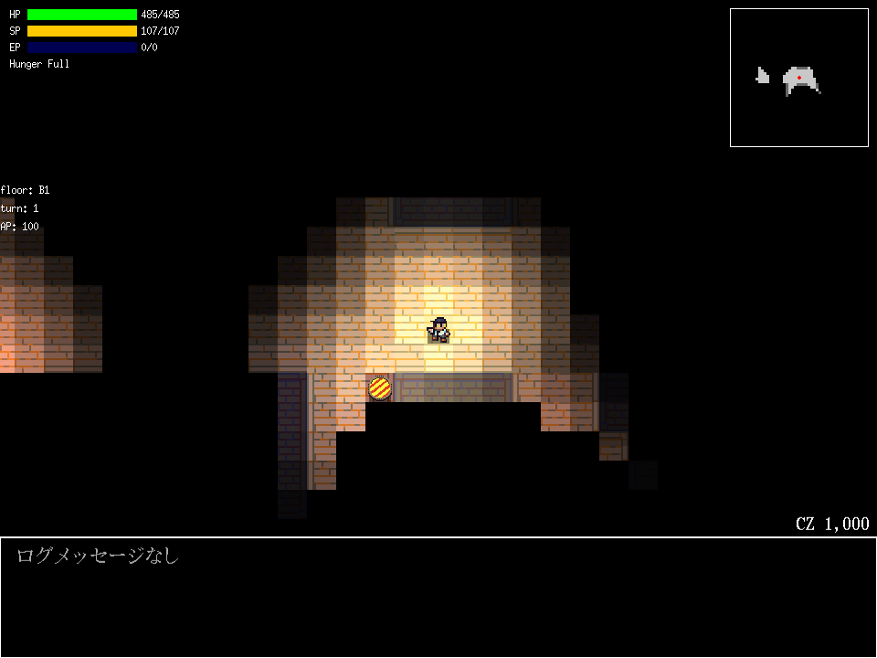
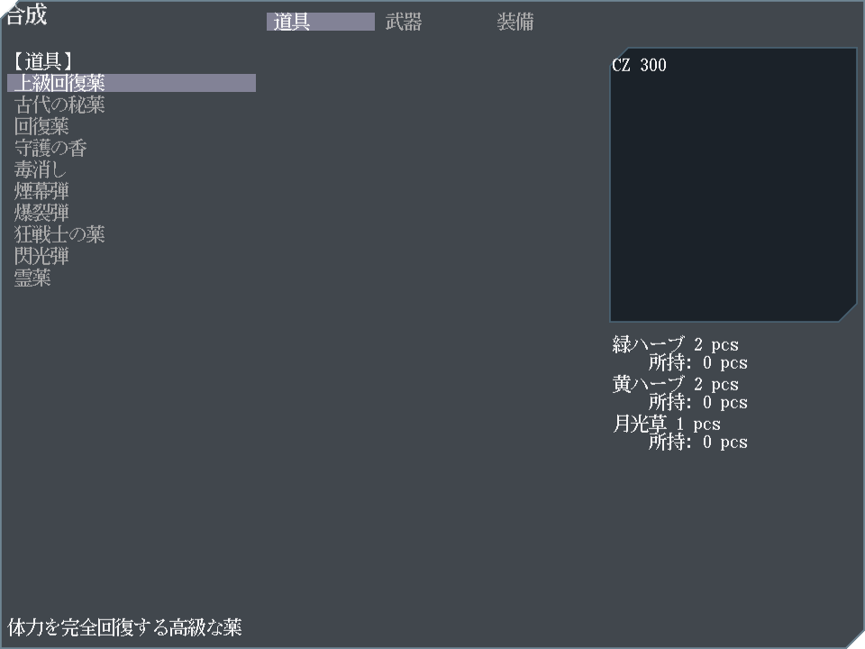

デッキ構築型RPG(予定)。

- [play](https://kijimad.github.io/ruins/)
- [godoc](https://kijimad.github.io/ruins/godoc/pkg/github.com/kijimaD/ruins/lib/)

## Play Images

各画像は全自動でキャプチャされる。最新なことをCIで保証している。

## キーボード操作

### ダンジョン探索
- **W** - 前進
- **S** - 後退
- **A** - 左回転
- **D** - 右回転
- **C / PageDown** - ズームアウト
- **E / PageUp** - ズームイン
- **マウスホイール** - ズーム操作

### メニューナビゲーション
- **↑ / ↓** - 項目の上下移動
- **← / →** - グリッド表示時の左右移動
- **Tab** - 次の項目へ移動
- **Shift + Tab** - 前の項目へ移動
- **Enter** - 項目選択・決定
- **Escape** - キャンセル・戻る

### システム機能
- **F12** - パフォーマンスモニター表示切り替え

## Reference

ゲーム作成で参考にしたコード等。

- ゲームシステム面で、KONAMIのビデオゲーム『パワプロクンポケット』シリーズ10・11・12を参考にした
- https://github.com/x-hgg-x/sokoban-go
  - 最初にコピペして作成をはじめ、改変していった
  - ECSの使い方まわりで大きく参考にした
- https://github.com/x-hgg-x/goecsengine
  - sokoban-goの依存ライブラリ。ECSまわりの実装を参考にした
- https://bfnihtly.bracketproductions.com/
  - 設定ファイルによるファクトリまわりを参考にした
- https://krkrz.github.io/krkr2doc/kag3doc/contents/
  - サウンドノベルに必要な記法を参考にした
- https://ebitengine.org/en/examples/raycasting.html
  - レイキャストの実装の参考にした

使用した素材類。

- https://hpgpixer.jp/image_icons/vehicle/icon_vehicle.html
- http://jikasei.me/font/jf-dotfont/
- https://github.com/googlefonts/morisawa-biz-ud-gothic
- https://www.pixilart.com

## TODO

機能系。

- [x] キーボードベースの操作にする
- [x] テキストをアニメーション表示する機構を追加する
- [x] 敵に当たるとエンカウントするようにする
- [ ] 複数ステップある操作で「1つ戻る」ができない。装備選択、戦闘コマンド選択
- [ ] 敵の移動パターンを追加する

リファクタ系。

- [x] Linter導入する
- [x] ロガーを導入する
- [x] テストを並列実行にする
- [x] effects のlogger も logger packageを使う
- [x] introステートをタイプライター機構を使って書き直す
- [ ] 戦闘ステートをテスタブルにする
- [ ] フォント管理、リソース管理をworldから分離する
- [x] UIを共通化、わかりやすくする
- [ ] stateにUIとロジックすべて入っているのを直す
- [ ] UI resourceを分離する
- [ ] テーブル表示UIコンポーネントを作る(性能表示用)
- [ ] キーボード操作のエミュレートで自動テストする
- [x] FPS類が正しいか確認する
- [ ] 背景作成用のフィルタースクリプトを追加する(na2meを参考にする)
- [x] 開発/本番設定を指定できるようにする
- [ ] ステージ生成でシードを使えるようにする(テストで毎回同じにできるようにする)
- [ ] engine package で具体に対するimportを禁止する。 depguard でできるはず
- [ ] package を engine と app に分ける
- [x] euiext package を消す。現状わずかに使っているだけで、移行できるため
- [ ] スプライト取得を関数化する
