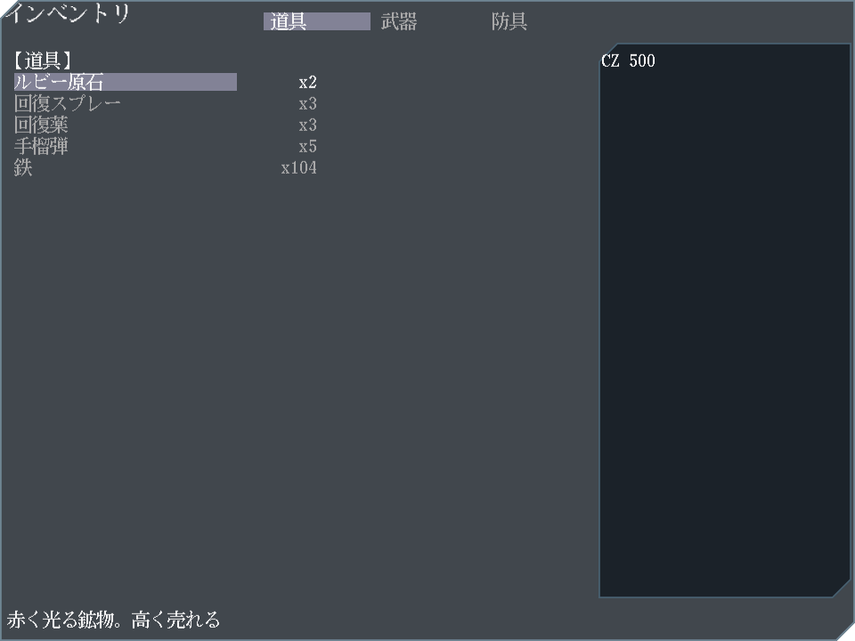
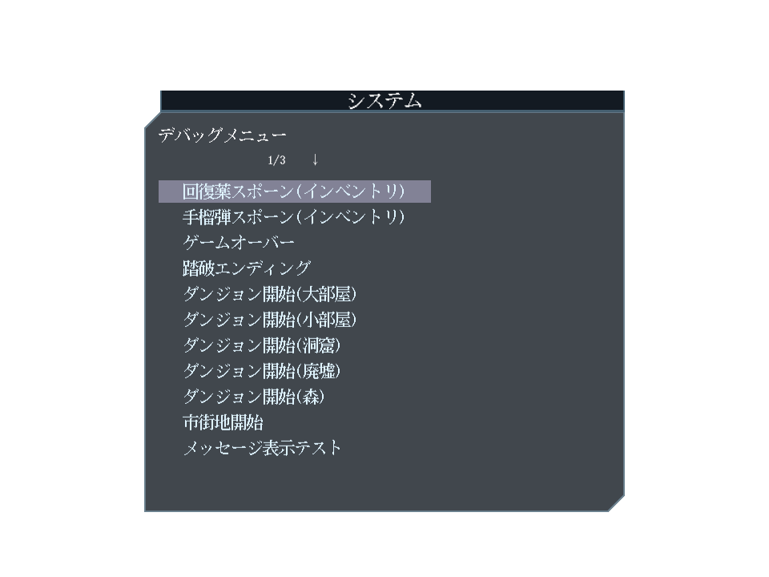

デッキ構築型RPG(予定)。

- [play](https://kijimad.github.io/ruins/)
- [godoc](https://kijimad.github.io/ruins/godoc/pkg/github.com/kijimaD/ruins/lib/)

## Play Images

各画像は全自動でキャプチャされる。最新なことをCIで保証している。

## Reference

ゲーム作成で参考にしたコード等。

- ゲームシステム面で、KONAMIのビデオゲーム『パワプロクンポケット』シリーズ10・11・12を参考にした
- https://github.com/x-hgg-x/sokoban-go
  - 最初にコピペして作成をはじめ、改変していった
  - ECSの使い方まわりで大きく参考にした
- https://github.com/x-hgg-x/goecsengine
  - sokoban-goの依存ライブラリ。改変しないと不便なことがけっこうあったので、コピペしてコードに含めた
- https://bfnihtly.bracketproductions.com/
  - 設定ファイルによるファクトリまわりを参考にした
- https://krkrz.github.io/krkr2doc/kag3doc/contents/
  - サウンドノベルに必要な記法を参考にした
- https://ebitengine.org/en/examples/raycasting.html
  - レイキャストの実装の参考にした

使用した素材類。

- https://hpgpixer.jp/image_icons/vehicle/icon_vehicle.html
- http://jikasei.me/font/jf-dotfont/
- https://github.com/googlefonts/morisawa-biz-ud-gothic
- https://www.pixilart.com

## TODO

- [ ] フォント管理、リソース管理をworldから分離する
- [ ] UIを共通化、わかりやすくする
- [ ] stateにUIとロジックすべて入っているのを直す
- [ ] UI resouceを分離する
- [ ] テーブル表示UIを作る(性能表示用)
- [x] キーボードベースの操作にする
- [ ] キーボード操作のエミュレートで自動テストする
- [x] Linter導入する
- [x] ロガーを導入する
- [ ] FPS類が正しいか確認する
- [ ] 背景作成用のフィルタースクリプトを追加する(na2meを参考にする)
- [ ] 開発/本番設定を指定できるようにする
- [ ] 複数ステップある操作で「1つ戻る」ができない。装備選択、戦闘コマンド選択
- [ ] ステージ生成でシードを使えるようにする(テストで毎回同じにできるようにする)
- [ ] テストを並列実行にする
- [ ] engine package で実装importを禁止する
- [ ] package を engine と app に分ける
- [ ] effects のlogger も logger packageを使う

## Memo

- UI
  - 実装と外観を分離して理解しやすい
  - キーボードベースの操作である
  - テスト可能である
  - メニュー操作が多い
  - 共通のメニューコンポーネントを使用する
    - コンポーネントは状態を持つ。コンポーネントの変化した状態によって各ステートでのアクションを発火したり変更を反映できる
    - テスト可能である
    - メニューではカーソルキーによる上下の選択と、タブキーによるタブの選択ができる
