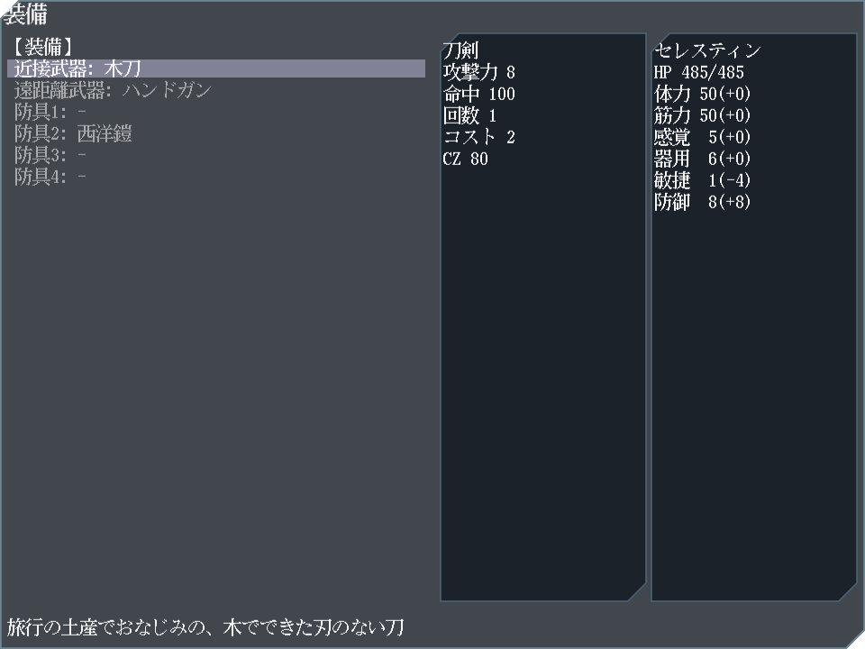
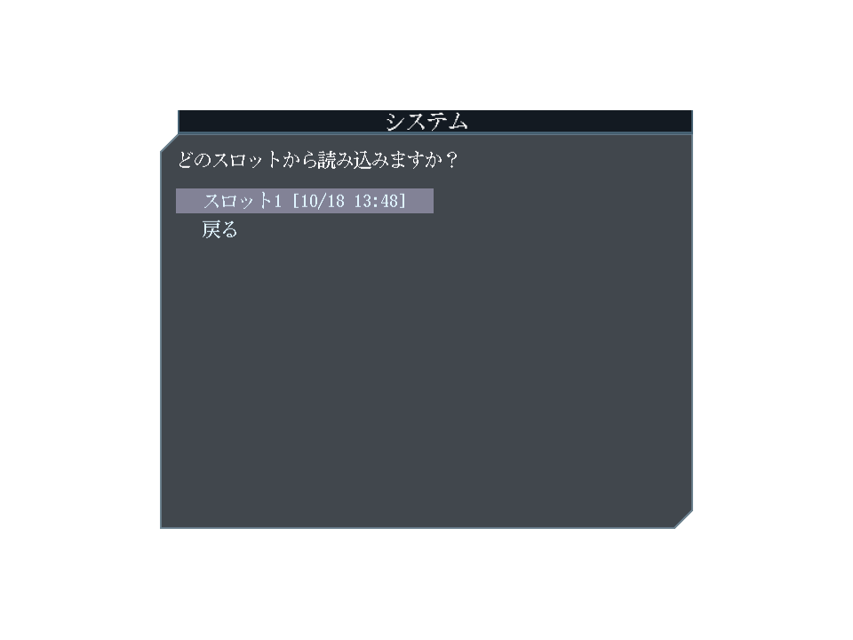
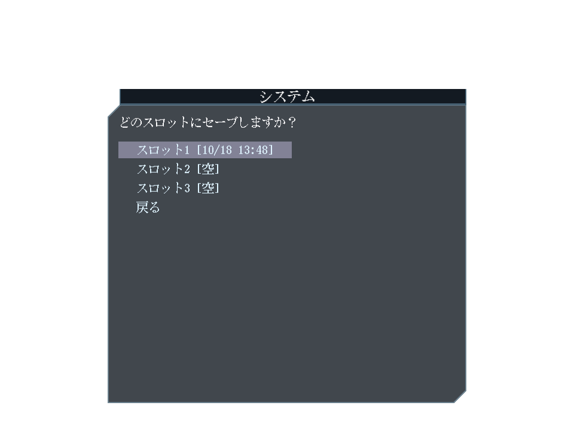

ローグライク。

- [play](https://kijimad.github.io/ruins/)
- [godoc](https://kijimad.github.io/ruins/godoc/pkg/github.com/kijimaD/ruins/lib/)

## Play Images

各画像は全自動でキャプチャされる。最新なことをCIで保証している。

## キーボード操作

### ダンジョン探索
- **W** - 上
- **S** - 下
- **A** - 左
- **D** - 右
- **C / PageDown** - ズームアウト
- **E / PageUp** - ズームイン
- **マウスホイール** - ズーム操作

### メニューナビゲーション
- **↑ / ↓** - 項目の上下移動
- **← / →** - グリッド表示時の左右移動
- **Tab** - 次の項目へ移動
- **Shift + Tab** - 前の項目へ移動
- **Enter** - 項目選択・決定
- **Escape** - キャンセル・戻る

## Reference

ゲーム作成で参考にしたコード等。

- https://github.com/x-hgg-x/sokoban-go
  - 最初にコピペして作成をはじめ、改変していった
  - ECSの使い方まわりで参考にした
- https://github.com/x-hgg-x/goecsengine
  - ゲームステート作成まわりで参考にした
- https://bfnihtly.bracketproductions.com/
  - 設定ファイルによるファクトリ、ゲームログまわりを参考にした
- https://krkrz.github.io/krkr2doc/kag3doc/contents/
  - サウンドノベルに必要な記法を参考にした
- https://ebitengine.org/en/examples/raycasting.html
  - レイキャストの実装の参考にした
- https://cataclysmdda.org/
  - ローグライクシステムの参考にした
- ゲームシステム面で、KONAMIのビデオゲーム『パワプロクンポケット』シリーズ10・11・12を参考にした
  - 途中の方針転換で、あまり残っていない

使用した素材類。

- https://hpgpixer.jp/image_icons/vehicle/icon_vehicle.html
- http://jikasei.me/font/jf-dotfont/
- https://github.com/googlefonts/morisawa-biz-ud-gothic
- https://www.pixilart.com
